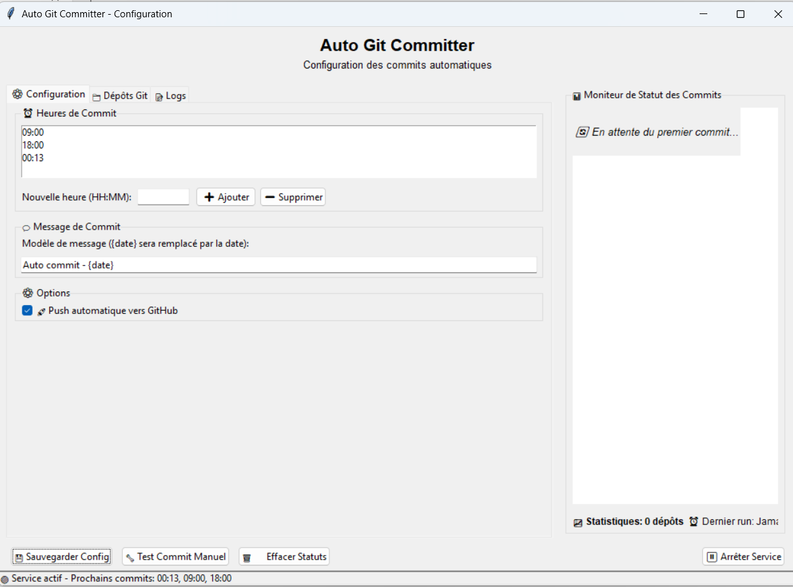

# Auto Git Committer 🚀

Un outil Python avec interface graphique pour automatiser les commits Git de tous vos dépôts locaux selon un planning personnalisé.

## 📋 Table des Matières

- [Fonctionnalités](#-fonctionnalités)
- [Installation](#-installation)
- [Utilisation](#-utilisation)
- [Interface Graphique](#-interface-graphique)
- [Configuration](#-configuration)
- [Mode Console](#-mode-console)
- [Structure des Fichiers](#-structure-des-fichiers)
- [Exemples d'Utilisation](#-exemples-dutilisation)
- [Dépannage](#-dépannage)

## ✨ Fonctionnalités

- **Commits automatiques planifiés** : Configurez des heures précises pour les commits automatiques
- **Interface graphique intuitive** : Configuration facile avec une GUI moderne
- **Moniteur de statut en temps réel** : Suivez l'état de tous vos dépôts en direct
- **Push automatique** : Option pour pousser automatiquement vers les dépôts distants
- **Gestion multi-dépôts** : Traite automatiquement tous les dépôts Git du dossier
- **Logs détaillés** : Historique complet de toutes les opérations
- **Mode console** : Exécution en arrière-plan sans interface graphique
- **Configuration persistante** : Sauvegarde automatique des paramètres

## 🔧 Installation

### Prérequis

- Python 3.7 ou supérieur
- Git installé et configuré
- Modules Python requis : `schedule`, `tkinter` (inclus par défaut)

### Installation des dépendances

```bash
pip install schedule
```

### Téléchargement

1. Téléchargez le fichier `auto_git_committer.py`
2. Placez-le dans le dossier parent de vos dépôts Git
3. Assurez-vous que vos dépôts Git sont dans des sous-dossiers

## 🚀 Utilisation

### Lancement en mode GUI

```bash
python auto_git_committer.py
```

### Lancement en mode console

```bash
python auto_git_committer.py --console
```

## 🖥️ Interface Graphique

L'interface graphique offre une expérience utilisateur complète avec plusieurs sections :

### Capture d'écran de l'interface



*Ajoutez votre capture d'écran de l'interface ici*

### Sections de l'interface

#### 1. **Onglet Configuration ⚙️**
- **Heures de Commit** : Définissez les heures précises pour les commits automatiques
- **Message de Commit** : Personnalisez le modèle de message (supporte `{date}` pour l'horodatage)
- **Options** : Activation/désactivation du push automatique

#### 2. **Onglet Dépôts Git 📁**
- Liste de tous les dépôts Git détectés
- Statut de chaque dépôt (à jour ou avec changements)
- Date de dernière modification

#### 3. **Onglet Logs 📝**
- Historique détaillé de toutes les opérations
- Messages d'erreur et de succès
- Horodatage de chaque action

#### 4. **Moniteur de Statut 📊**
- Suivi en temps réel des commits
- Statuts visuels avec icônes :
  - ⏳ En attente
  - 🔄 En cours
  - ✅ Succès
  - ❌ Échec
  - ⏭️ Ignoré
- Statistiques globales
- Barres de progression pour les opérations en cours

#### 5. **Boutons de Contrôle**
- **💾 Sauvegarder Config** : Sauvegarde la configuration
- **🔧 Test Commit Manuel** : Lance un commit immédiat
- **🗑️ Effacer Statuts** : Nettoie l'affichage du moniteur
- **▶️ Démarrer/⏸️ Arrêter Service** : Contrôle du service automatique

## ⚙️ Configuration

### Fichier de configuration (config.json)

Le fichier de configuration est automatiquement créé au premier lancement :

```json
{
    "commit_times": ["09:00", "18:00"],
    "commit_message": "Auto commit - {date}",
    "excluded_folders": [".git", "__pycache__", ".vscode", "node_modules"],
    "excluded_files": [".exe", ".log", "config.json"],
    "auto_push": true
}
```

### Paramètres configurables

- **`commit_times`** : Liste des heures de commit (format HH:MM)
- **`commit_message`** : Modèle de message de commit (`{date}` sera remplacé)
- **`excluded_folders`** : Dossiers à ignorer lors de la recherche de dépôts
- **`excluded_files`** : Extensions de fichiers à ignorer
- **`auto_push`** : Active/désactive le push automatique

## 💻 Mode Console

Pour une utilisation en arrière-plan ou sur des serveurs :

```bash
python auto_git_committer.py --console
```

**Avantages du mode console :**
- Consommation mémoire réduite
- Fonctionnement en arrière-plan
- Idéal pour les serveurs
- Logs dans la console et fichier

**Contrôle :**
- `Ctrl+C` pour arrêter le service

## 📂 Structure des Fichiers

```
dossier-parent/
├── auto_git_committer.py    # Script principal
├── config.json              # Configuration (généré automatiquement)
├── git_commits.log          # Fichier de logs
├── depot-git-1/             # Vos dépôts Git
│   └── .git/
├── depot-git-2/
│   └── .git/
└── depot-git-3/
    └── .git/
```

## 📝 Exemples d'Utilisation

### Configuration typique

1. **Commits matinaux et de fin de journée :**
   - Heures : `09:00`, `18:00`
   - Message : `"Auto commit - {date}"`
   - Push automatique : Activé

2. **Commits toutes les 4 heures :**
   - Heures : `08:00`, `12:00`, `16:00`, `20:00`
   - Message : `"Sauvegarde automatique - {date}"`

3. **Mode développement intensif :**
   - Heures : `10:00`, `14:00`, `16:00`, `18:00`, `22:00`
   - Push automatique : Désactivé (pour révision manuelle)

### Workflow recommandé

1. **Installation** : Placez le script dans votre dossier de projets
2. **Configuration initiale** : Lancez la GUI et configurez vos préférences
3. **Test** : Utilisez "Test Commit Manuel" pour vérifier le fonctionnement
4. **Activation** : Démarrez le service automatique
5. **Surveillance** : Utilisez le moniteur de statut pour suivre les opérations

## 🔍 Dépannage

### Problèmes courants

#### Le script ne trouve pas mes dépôts Git
- Vérifiez que le script est dans le dossier parent de vos dépôts
- Assurez-vous que vos dossiers contiennent un répertoire `.git`

#### Erreur lors du push
- Vérifiez votre configuration Git (`git config --list`)
- Assurez-vous que vos clés SSH/tokens sont configurés
- Vérifiez la connexion réseau

#### L'interface ne se lance pas
```bash
# Vérifiez que tkinter est installé
python -c "import tkinter; print('OK')"

# Si erreur sur Linux :
sudo apt-get install python3-tk
```

#### Le service ne démarre pas
- Vérifiez qu'au moins une heure de commit est configurée
- Consultez les logs pour plus de détails
- Redémarrez l'application

### Messages d'erreur fréquents

| Erreur | Solution |
|--------|----------|
| `fatal: not a git repository` | Le dossier n'est pas un dépôt Git valide |
| `Permission denied (publickey)` | Configurez vos clés SSH pour GitHub |
| `nothing to commit` | Aucun changement détecté (normal) |
| `Connection refused` | Vérifiez votre connexion réseau |

### Logs et diagnostic

- **Fichier de log** : `git_commits.log`
- **Niveau de détail** : INFO, WARNING, ERROR
- **Rotation** : Les logs s'accumulent (nettoyage manuel recommandé)

## 🤝 Contribution

Les contributions sont les bienvenues ! N'hésitez pas à :

- Signaler des bugs
- Proposer des améliorations
- Soumettre des pull requests
- Améliorer la documentation

## 📄 Licence

Ce projet est sous licence MIT. Voir le fichier LICENSE pour plus de détails.

## 🆘 Support

Si vous rencontrez des problèmes :

1. Consultez la section [Dépannage](#-dépannage)
2. Vérifiez les logs dans `git_commits.log`
3. Ouvrez une issue avec les détails de votre problème

---

**Auto Git Committer** - Simplifiez votre workflow Git avec l'automatisation ! 🚀